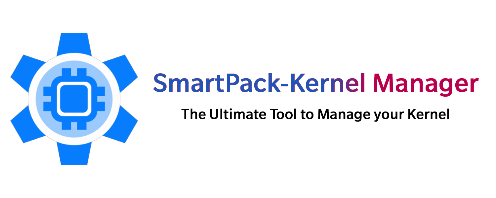

# Introduction
Welcome to the development center of SmartPack-Kernel Manager, a heavily modified version of Kernel Adiutor originally developed by Willi Ye aka Grarak. All the credits go to the original developer. 

## Download

     
          
                    

## Features
* Almost all the features available in Kernel Adiutor.
* Option to flash recovery zip files while running Android OS.
* A simple and user-friendly Custom Controller, which is totally different to that of the official KA ([Documentation](https://smartpack.github.io/spkm/customcontrols/)).
* A Script Manager to easily create, import, edit, share and execute any properly formatted shell scripts.
* A Kernel downloader, which is also totally different to that of the official KA ([Documentation](https://smartpack.github.io/kerneldownloads/)).
* CPU Input Boost & Devfreq Boost (Sultanxda).
* Simple MSM Thermal (Sultanxda).
* Advanced Control for Fast Charge (yank555.lu) & Boeffla Charge Level Interface (Lord Boeffla).
* K-Lapse Support (tanish2k09)
* Boeffla Sound (Lord Boeffla) with Per-channel Control
* Per-channel control for Flar's sound.
* Significantly different Faux Sound implementation.
* In-built Spectrum Support (frap129).
* Wake and sleep gestures (flar2).
* Adreno Boost (flar2).
* Dynamic Stune Boost (joshuous)
* MSM Sleeper (flar2).
* Boeffla Wakelock Blocker (Lord Boeffla).
* Display Backlight Control (Min & Max).
* Switches to tweak SELinux, Android Doze mode and PrintK logging.
* WireGuard version information.
* Auto-updates (in *About* page).
* Real-time Charging Status.
* RAM & Swap Status.
* LED Blink/Fade support.
* Dedicated Frequently Asked Questions (FAQ) section.
* Also compatible with any devices and kernels.
* And much more…

## Donations
If you like to appreciate my efforts to provide this applications entirely free, non-intrusive and without Ads, please consider supporting the development in some way. Maintaining this project takes the most majority of free time in my life. So, each and every support from the android community will be hugely appreciated.

#### Some other ways to support this project includes, but not limited to
* Leave a good rating or/and review in [Google Play](https://play.google.com/store/apps/details?id=com.smartpack.kernelmanager.release) (It's free)!
* Help me to translate this application into your local language (or improve existing translations).
* Share good words about this application with others (family, friends, and other enthusiastic android users).

## Credits

#### Willi Ye

* [Kernel Adiutor](https://github.com/Grarak/KernelAdiutor)

#### John Wu

* [libsu](https://github.com/topjohnwu/libsu)

#### Chris Renshaw

* [Auto-flash](https://github.com/osm0sis)

#### Joe Maples

* [Spectrum](https://github.com/frap129/spectrum)

#### Translations
Please help me to translate this application via [POEditor](https://poeditor.com/join/project?hash=qWFlVfAlp5). You may also translate after downloading the original language string available [here](app/src/main/res/values/strings.xml).

* [jason5545](https://github.com/jason5545), Chinese (Traditional)
* [Roiyaru](https://github.com/Roiyaru) & [YFdyh000](https://github.com/yfdyh000), Chinese (simplified)
* [Andrey](https://github.com/andrey167), tommynok & [kiratt](http://4pda.ru/forum/index.php?showuser=5859577), Russian
* [Lennoard Silva](https://github.com/Lennoard), Portuguese (Brazilian)
* [SmgKhOaRn](https://github.com/SmgKhOaRn), Korean
* [kiratt](http://4pda.ru/forum/index.php?showuser=5859577) & tommynok, Ukrainian
* [Mikesew1320](https://github.com/Mikesew1320), Amharic
* [free-bots](https://github.com/free-bots) & Lars S, German
* Alejandro YT & Cold, Spanish
* [Fruity-0](https://github.com/Fruity-0), Polish
* [Fatih Fırıncı](https://github.com/Fatih-BaKeR) & omerakgoz34, Turkish
* Phil, Portuguese (Portugal)
* Catellone94 & Gianfranco. liguori.96, Italian
* Many other people contributed via [POEditor](https://poeditor.com/join/project?hash=qWFlVfAlp5)

_If you think I missed your name, please let me know._

## Report a bug or request a feature

You can report a bug or request a feature by [opening an issue](https://github.com/SmartPack/SmartPack-Kernel-Manager/issues/new).

#### How to report a bug
* A detailed description of the bug
* Logcat
* Make sure that no similar bugs are already reported

#### How to request a feature
* A detailed description of the feature
* All kind of information
* Paths to sysFS interface
* What's the content of the sysFS interface
* How to apply a new value
* Make sure that no similar feature us already requested.

## License

    Copyright (C) 2021-2022 sunilpaulmathew <sunil.kde@gmail.com>

    SmartPack Kernel Manager is a free softwares: you can redistribute
    it and/or modify it under the terms of the GNU General Public License as
    published by the Free Software Foundation, either version 3 of the License,
    or (at your option) any later version.

    SmartPack Kernel Manager is distributed in the hope that it will be useful,
    but WITHOUT ANY WARRANTY; without even the implied warranty of MERCHANTABILITY
    or FITNESS FOR A PARTICULAR PURPOSE. See the GNU General Public License for more
    details.

    You should have received a copy of the GNU General Public License along with
    SmartPack Kernel Manager. If not, see <http://www.gnu.org/licenses/>.

***** ***** ***** ***** ***** ***** ***** ***** ***** ***** *****

## About Kernel Adiutor

* [Join Google+ Community](https://plus.google.com/communities/108445529270785762340) (Beta Testing)

## Credits

I used following libraries:

* Google: [AndroidX Library](https://developer.android.com/jetpack/androidx/)
* Google: [NavigationView library](https://developer.android.com/reference/com/google/android/material/navigation/NavigationView)
* Ozodrukh: [CircularReveal](https://github.com/ozodrukh/CircularReveal)
* Roman Nurik: [dashclock](https://github.com/romannurik/dashclock)
* Google: [Firebase](https://firebase.google.com)
* Matthew Precious: [swirl](https://github.com/mattprecious/swirl)
* Lopez Mikhael: [CircularImageView](https://github.com/lopspower/CircularImageView)
* Square: [picasso](https://github.com/square/picasso)
* CyanogenMod: [CyanogenMod Platform SDK](https://github.com/CyanogenMod/cm_platform_sdk)
* Akexorcist: [Android-RoundCornerProgressBar](https://github.com/akexorcist/Android-RoundCornerProgressBar)

Also codes from different people:

#### Andrei F.

* [RootUtils](https://github.com/Grarak/KernelAdiutor/blob/master/app/src/main/java/com/grarak/kerneladiutor/utils/root/RootUtils.java)

#### apbaxel

_(Many sys interface paths has been taken from his [UKM-Project](https://github.com/apbaxel/UKM))_

#### Brandon Valosek

* [CpuSpyApp](https://github.com/Grarak/KernelAdiutor/blob/master/app/src/main/java/com/bvalosek/cpuspy/CpuSpyApp.java)
* [CpuStateMonitor](https://github.com/Grarak/KernelAdiutor/blob/master/app/src/main/java/com/bvalosek/cpuspy/CpuStateMonitor.java)
* [OverallFragment](https://github.com/Grarak/KernelAdiutor/blob/master/app/src/main/java/com/grarak/kerneladiutor/fragments/statistics/OverallFragment.java)

## License

    Copyright (C) 2015-2016 Willi Ye <williye97@gmail.com>
    
    Kernel Adiutor is free software: you can redistribute it and/or modify
    it under the terms of the GNU General Public License as published by
    the Free Software Foundation, either version 3 of the License, or
    (at your option) any later version.
    
    Kernel Adiutor is distributed in the hope that it will be useful,
    but WITHOUT ANY WARRANTY; without even the implied warranty of
    MERCHANTABILITY or FITNESS FOR A PARTICULAR PURPOSE.  See the
    GNU General Public License for more details.
    
    You should have received a copy of the GNU General Public License
    along with Kernel Adiutor.  If not, see <http://www.gnu.org/licenses/>.
